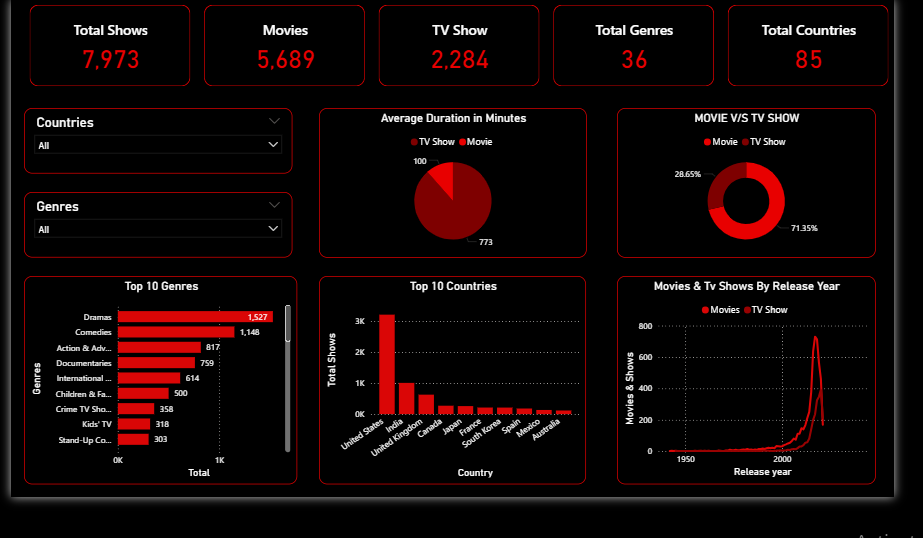

# Netflix-Data-Analysis-in-Power-BI
A complete end-to-end data analysis and visualization project on Netflix titles using Power BI. This project explores content trends across genres, countries, duration, and format (Movie vs. TV Show), helping to uncover patterns in the global entertainment landscape.

📁 Dataset
Source: Netflix Titles Dataset
Format: CSV
Total Records: ~7,000+
Columns: Title, Type, Country, Genre, Duration, Release Year, and more

🎯 Objectives
Analyze and visualize Netflix content trends.  
Provide insights on:
Content types (Movies vs TV Shows)
Top contributing genres and countries
Release patterns over the years
Average durations by content type
Overall catalog distribution

📈 Visualizations & Dashboards
✅ KPI Cards
📌 Total Shows
🎬 Total Movies
📺 Total TV Shows
🏷️ Total Genres
🌍 Total Countries

✅ Main Visuals
🎞️ Top 10 Genres
🌐 Top 10 Countries by Content
📆 Movies and TV Shows by Release Year
🔁 Movie vs TV Show Distribution
⏱️ Average Duration for Movies and TV Shows (in minutes)

✅ Interactive Filters
Filter by Country
Filter by Genre

🧠 Key Insights
🎬 Movies dominate Netflix’s catalog, making up approximately 71.35% of all content, compared to 28.65% TV Shows.
📌 Total Titles: The dataset contains 7,973 total shows, with 5,689 movies and 2,284 TV shows.
🕒 Average Duration: Movies have an average duration of 773 minutes and TV Shows average 100 minutes, likely based on seasons.
🌍 Top Producing Countries: United States leads by a large margin with over 3,000+ titles. India, United Kingdom, and Canada follow with noticeable contributions.
🏷️ Top 10 Genres: Drama is the most popular genre with 1,527 titles, followed by Comedies (1,148) and Action & Adventure (817). T
📈 Content Release Trends: There was a sharp increase in releases post-2010, with a significant spike between 2015 and 2020, indicating Netflix's aggressive content expansion.
🌐 Global Reach: Netflix has content from 85 countries, with 36 unique genres, reflecting its global content strategy.

📎 Tools Used
💡 Power BI for data modeling and interactive dashboards
🧼 Power Query for data cleaning and transformation
📊 DAX for measures and calculated insights
🧮 CSV Dataset from Kaggle
